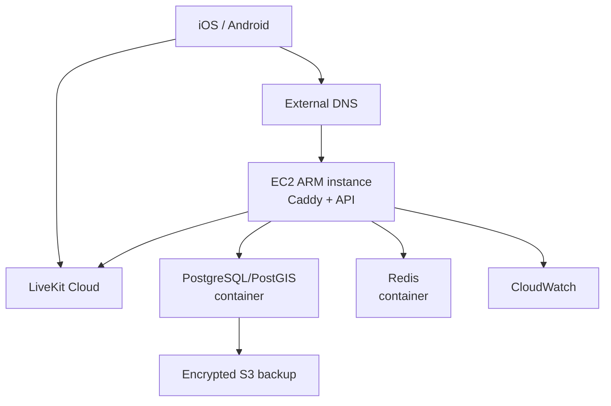
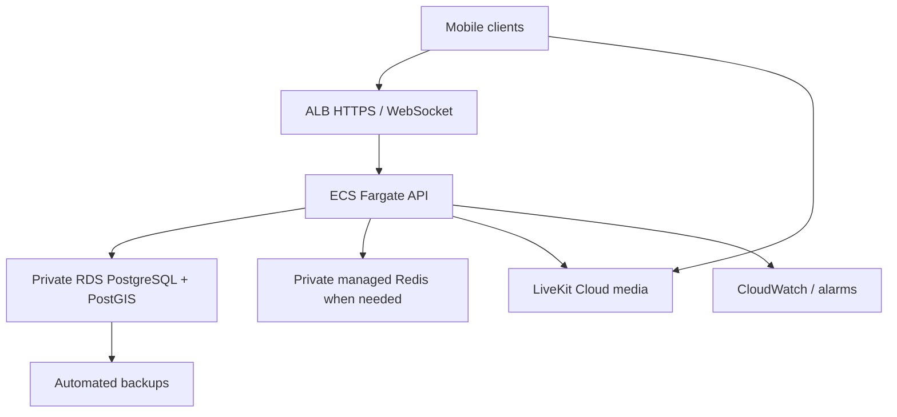

# RoadTalk AWS Architecture

- Status: Approved for Sprint 1 implementation
- Region: `us-east-1`
- Issue: #8
- Requirements: S00-R05
- Acceptance: S00-T04
- Date: 2026-07-12

## Stage 1: Local development

Docker Compose services:

- FastAPI control API
- PostgreSQL with PostGIS
- Redis only when an implemented feature requires it
- optional local LiveKit for integration testing
- local mail/push substitutes where practical

No developer credentials or production data are committed to the repository.

## Stage 2: Controlled field test

### Resources

- one VPC spanning at least two AZs for later growth
- one public subnet used by the field-test EC2 instance
- one public IPv4 address; an Elastic IP is optional, not assumed
- security group allowing HTTPS and required administration path; no public database/cache ports
- Systems Manager preferred for administration
- ARM EC2 starting target: `t4g.small`, subject to load validation and resize only
  after measured evidence
- encrypted gp3 EBS, starting at 40 GB
- Caddy for TLS termination and control routing
- API, PostgreSQL/PostGIS, backup, and monitoring containers; Redis remains absent
  until implemented presence/fanout behavior proves it necessary
- S3 bucket with encryption, versioning, lifecycle, and blocked public access
- CloudWatch log groups, metrics, alarms, and short retention
- SSM Parameter Store or Secrets Manager for runtime secrets
- AWS Budget and cost-anomaly monitoring

### Explicit limitations

- single instance and single volume are a shared failure domain
- maintenance causes downtime
- database restore is the recovery strategy
- no claim of production availability
- field test is invite-only and capacity-limited
- no LiveKit self-hosting on this shared node

## Stage 3: Production baseline

### Network

- public subnets contain only internet-facing load-balancing resources
- ECS, RDS, and cache use private subnets
- security groups reference other security groups
- RDS and cache have no public endpoints
- NAT Gateway is deferred until a private-workload egress requirement and cost review justify it; use VPC endpoints where economical
- TLS certificates are managed and rotated
- DNS remains external unless an ADR changes it

### Compute and ingress

- ECS Fargate ARM64 API task, initially 0.5 vCPU/1 GB after load validation
- one task for controlled pre-production; two across AZs for production availability
- ALB handles REST and control WebSockets
- HTTP health endpoint is separate from WebSocket behavior
- immutable container images in ECR
- deployment rollback retains the previous task definition/image
- background workers are separate task definitions only when implemented

### Data

- RDS PostgreSQL with PostGIS, encrypted storage, private access
- single-AZ for controlled pre-production; Multi-AZ before availability commitments
- automated backups with 7-day initial retention and tested restore
- deletion protection for production
- Redis is not deployed until presence/fanout measurements require it
- no durable audio storage

### Media

- LiveKit Cloud is the initial production media plane
- RoadTalk API issues short-lived grants
- recording, egress, transcription, and AI processing remain disabled
- self-hosting requires a new accepted ADR, dedicated capacity, TURN/network design, monitoring, upgrades, and cost evidence

### Observability and recovery

- structured privacy-filtered logs
- API, ALB, database, media-grant, and client-quality metrics
- alarms route to an operational contact
- recovery runbook covers API redeploy, database restore, credential rotation, and media-provider degradation
- target production RPO: 24 hours initially; target RTO: 4 hours, tightened before broad launch
- CloudTrail and AWS Config/security services are enabled according to environment risk and cost

## Scaling triggers

| Signal | Action |
|---|---|
| API CPU/memory sustained above 70% | Increase task count/size after profiling. |
| Control latency or active WebSockets exceed one task target | Add tasks and shared Redis coordination. |
| Database CPU/IO/connection pressure sustained above 70% | Tune queries/pooling, then resize/read-scale. |
| Proximity queries miss NFR | Inspect spatial plan/index, update policy, then partition/cache if proven necessary. |
| Media cost exceeds self-hosted total-cost threshold for 3 months | Run a self-hosting ADR and capacity test. |
| Public availability commitment | Two API tasks, Multi-AZ database, tested failover, stronger monitoring. |

## Primary references

- [AWS ECS inbound networking](https://docs.aws.amazon.com/AmazonECS/latest/developerguide/networking-inbound.html)
- [ALB target health](https://docs.aws.amazon.com/elasticloadbalancing/latest/application/target-group-health-checks.html)
- [AWS RDS PostGIS](https://docs.aws.amazon.com/AmazonRDS/latest/UserGuide/Appendix.PostgreSQL.CommonDBATasks.PostGIS.html)
- [LiveKit deployment](https://docs.livekit.io/transport/self-hosting/deployment/)
