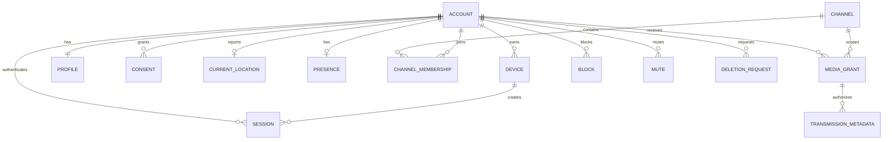

# RoadTalk Logical Data Model

- Status: Approved for Sprint 1 implementation
- Sprint: 0
- Requirements: S00-R04
- Acceptance: S00-T03
- Issue: #7
- Date: 2026-07-12

## Principles

- PostgreSQL/PostGIS is the durable source of truth.
- UUID primary keys are opaque.
- Every mutable table has `created_at`, `updated_at`, and an optimistic `version` where concurrent updates matter.
- Exact location is sensitive and never joined into public profile responses.
- Transient presence may be cached in Redis but has a database-defined authorization context.
- Audio is not stored for Sprints 1–5.
- Deletion and retention state is explicit rather than inferred.

## Entity relationship model

## Core entities

### account

- `id`
- `status`: active, suspended, deletion_pending, deleted
- `account_type`: anonymous initially
- `policy_version_accepted`
- `deleted_at`
- timestamps/version

The row contains no public callsign/avatar fields.

### device

- `id`, `account_id`
- platform and app version
- push-provider token ciphertext/reference
- device credential fingerprint
- last seen
- revoked timestamp
- timestamps/version

Raw platform tokens are encrypted and never logged.

### session

- `id`, `account_id`, `device_id`
- refresh credential hash/family
- issued, expires, last used, revoked
- revocation reason
- approximate security metadata where justified

Access tokens are not stored. Refresh secrets are stored only as secure hashes or provider references.

### profile

- `account_id`
- normalized callsign and display callsign
- avatar object key/reference
- optional public fields approved in Sprint 2
- visibility and moderation state
- timestamps/version

Callsign normalization and uniqueness are database-enforced.

### consent

- `id`, `account_id`
- consent type: terms, privacy, foreground location, background location, microphone, notifications
- policy version
- granted/revoked timestamps
- source platform and disclosure version

Revocation is append-only history plus current effective state.

### current_location

- `account_id`
- `position geography(Point,4326)`
- client observed time and server received time
- horizontal accuracy meters
- optional heading degrees and speed meters/second
- collection mode
- client sequence
- expires at
- consent version
- quality/validation state
- timestamps/version

Index: GiST on `position`; B-tree on `expires_at` and effective-state fields. Only the latest usable sample is required for MVP proximity.

### presence

- `account_id`
- state: active, receive_only, away, offline
- connection owner
- selected channel
- last heartbeat and expires at
- app/background mode
- timestamps/version

The fast path may live in Redis with TTL. Durable representation must never be used as proof of a live connection after expiry.

### channel

- `id`, stable slug, display name
- type: general or RV for MVP
- enabled and policy fields
- timestamps/version

### channel_membership

- `account_id`, `channel_id`
- membership/selection state
- joined and left times
- timestamps/version

Unique active membership constraints follow the approved channel model.

### media_grant

- `id`, `account_id`, `device_id`, `channel_id`
- opaque media room/participant references
- action scope
- eligibility-policy version
- issued, expires, revoked
- denial/revocation code when retained
- timestamps

Never store the signed LiveKit token.

### transmission_metadata

- `id`, `media_grant_id`, transmitter account
- channel and opaque room reference
- started/ended timestamps
- technical outcome/termination code
- optional aggregate quality metrics
- retention expiry

No audio, transcript, or precise listener-location list.

### block and mute

Directed relationships with actor, target, scope, reason category, created, and optional expiry. Authorization queries apply these before media grants.

### deletion_request

- account and request identifier
- requested, verified, processing, completed timestamps
- status and failure code
- retention exceptions with legal/security rationale
- deletion job version

## Proximity eligibility query

The durable reference query:

1. selects non-expired, validated current locations
2. joins active consent, presence, channel, account, block, and mute state
3. applies `ST_DWithin(candidate.position, sender.position, radius_meters)`
4. excludes the sender
5. returns opaque eligible account identifiers only to the authorization service

The query never returns candidate coordinates to the transmitting client.

## Location quality rules

A sample is unusable when:

- coordinates or accuracy are invalid
- observed time is too old or materially in the future
- client sequence is not newer
- required consent is absent/revoked
- accuracy exceeds the configured threshold
- movement is implausible without an accepted transition rule
- expiry has passed

Thresholds live in versioned policy configuration and are referenced from media grants.

## Retention baseline

| Data | Initial rule |
|---|---|
| Current location | Replace in place; expire quickly; delete on withdrawal/account deletion. |
| Historical location | Not collected in Sprints 1–5. |
| Audio/transcripts | Not collected. |
| Presence | TTL-based; technical remnants expire within 24 hours. |
| Media grants/transmission metadata | Minimal security/quality record, target 30 days pending privacy review. |
| Sessions/devices | Active life plus security retention defined by privacy model. |
| Consent history | Retain policy evidence while account exists and only as legally/operationally required after deletion. |
| Application logs | 14 days bootstrap, 30 days production target; no exact location or tokens. |
| Backups | 7 days bootstrap; production target defined in AWS architecture. |

Final rules are controlled by the privacy model, not this table alone.

## Migration strategy

- Alembic migrations are ordered and committed with application changes.
- A migration is tested against an empty database and a copy of the previous schema.
- Destructive changes use expand/migrate/contract where live compatibility is required.
- PostGIS extension availability is verified before application migrations.
- Downgrade paths are supplied when safe; otherwise a restore/forward-fix plan is documented.
- Seed data is separate from schema migrations.
- Production migrations run as a controlled deployment step, not at every web-process startup.

## Required validation

- database constraints for normalized callsign, active relationships, and ownership
- spatial index use confirmed with `EXPLAIN`
- boundary-distance, stale, inaccurate, blocked, muted, and cross-channel cases
- out-of-order location update rejection
- consent revocation and deletion propagation
- concurrent grant/session/location updates
- backup restoration with PostGIS enabled
- logs and errors scanned for coordinates and secrets

## Primary references

- [PostGIS ST_DWithin](https://postgis.net/docs/ST_DWithin.html)
- [PostGIS radius-query guidance](https://postgis.net/documentation/tips/st-dwithin/)
- [Amazon RDS PostgreSQL PostGIS](https://docs.aws.amazon.com/AmazonRDS/latest/UserGuide/Appendix.PostgreSQL.CommonDBATasks.PostGIS.html)
