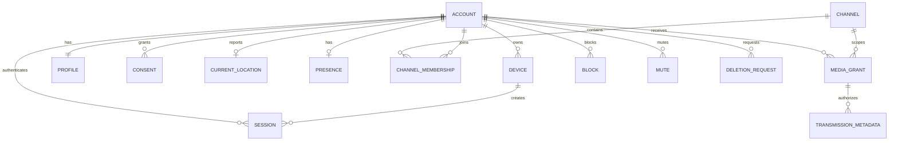

# RoadTalk Logical Data Model

- Status: Approved for Sprint 1 implementation
- Sprint: 0
- Requirements: S00-R04
- Acceptance: S00-T03
- Issue: #7
- Date: 2026-07-12

## Principles

- PostgreSQL/PostGIS is the durable source of truth.
- UUID primary keys are opaque.
- Every mutable table has `created_at`, `updated_at`, and an optimistic `version` where concurrent updates matter.
- Exact location is sensitive and never joined into public profile responses.
- Transient presence may be cached in Redis but has a database-defined authorization context.
- Audio is not stored for Sprints 1–5.
- Deletion and retention state is explicit rather than inferred.

## Entity relationship model

```mermaid
erDiagram
    ACCOUNT ||--o{ DEVICE : owns
    ACCOUNT ||--o{ SESSION : authenticates
    DEVICE ||--o{ SESSION : creates
    ACCOUNT ||--|| PROFILE : has
    ACCOUNT ||--o{ CONSENT : grants
    ACCOUNT ||--o| CURRENT_LOCATION : reports
    ACCOUNT ||--o| PRESENCE : has
    CHANNEL ||--o{ CHANNEL_MEMBERSHIP : contains
    ACCOUNT ||--o{ CHANNEL_MEMBERSHIP : joins
    ACCOUNT ||--o{ MEDIA_GRANT : receives
    CHANNEL ||--o{ MEDIA_GRANT : scopes
    ACCOUNT ||--o{ BLOCK : blocks
    ACCOUNT ||--o{ MUTE : mutes
    ACCOUNT ||--o{ DELETION_REQUEST : requests
    MEDIA_GRANT ||--o{ TRANSMISSION_METADATA : authorizes
```

## Core entities

### account

- `id`
- `status`: active, suspended, deletion_pending, deleted
- `account_type`: anonymous initially
- `policy_version_accepted`
- `deleted_at`
- timestamps/version

The row contains no public callsign/avatar fields.

### device

- `id`, `account_id`
- platform and app version
- push-provider token ciphertext/reference
- device credential fingerprint
- last seen
- revoked timestamp
- timestamps/version

Raw platform tokens are encrypted and never logged.

### session

- `id`, `account_id`, `device_id`
- refresh credential hash/family
- issued, expires, last used, revoked
- revocation reason
- approximate security metadata where justified

Access tokens are not stored. Refresh secrets are stored only as secure hashes or provider references.

### profile

- `account_id`
- normalized callsign and display callsign
- avatar object key/reference
- optional public fields approved in Sprint 2
- visibility and moderation state
- timestamps/version

Callsign normalization and uniqueness are database-enforced.

### consent

- `id`, `account_id`
- consent type: terms, privacy, foreground location, background location, microphone, notifications
- policy version
- granted/revoked timestamps
- source platform and disclosure version

Revocation is append-only history plus current effective state.

### current_location

- `account_id`
- `position geography(Point,4326)`
- client observed time and server received time
- horizontal accuracy meters
- optional heading degrees and speed meters/second
- collection mode
- client sequence
- expires at
- consent version
- quality/validation state
- timestamps/version

Index: GiST on `position`; B-tree on `expires_at` and effective-state fields. Only the latest usable sample is required for MVP proximity.

### presence

- `account_id`
- state: active, receive_only, away, offline
- connection owner
- selected channel
- last heartbeat and expires at
- app/background mode
- timestamps/version

The fast path may live in Redis with TTL. Durable representation must never be used as proof of a live connection after expiry.

### channel

- `id`, optional stable public slug, member-visible display label
- type: public or private
- enabled/closed state, creator account for private lifecycle authorization
- opaque server-owned provider room reference and policy version
- timestamps/version

Sprint 6 seeds General and RV with deterministic IDs/slugs and opaque room references.
Only those enabled public rows are browseable; private rows require an active caller
membership and never expose their creator or room reference through the catalog.

### channel_membership

- `account_id`, `channel_id`
- active/left membership state
- joined and left times
- timestamps/version

The composite account/channel primary key permits only one durable membership record.
Membership is authorization state, not presence, and public channels require no row.

### channel_selection

- `account_id` as the primary key
- current `channel_id`
- selected timestamp and optimistic version
- timestamps

Every migrated and newly created account receives exactly one General selection.
Account-row locking serializes changes. An unavailable selection falls back to General;
selection changes fail closed while media authority remains active until S06-D05 adds
revoke-before-switch reconciliation.

### media_grant

- `id`, `account_id`, `device_id`, `channel_id`
- opaque media room/participant references
- action scope
- eligibility-policy version
- issued, expires, revoked
- denial/revocation code when retained
- timestamps

Never store the signed LiveKit token.

### transmission_metadata

- `id`, `media_grant_id`, transmitter account
- channel and opaque room reference
- started/ended timestamps
- technical outcome/termination code
- optional aggregate quality metrics
- retention expiry

No audio, transcript, or precise listener-location list.

### block and mute

Directed relationships with actor, target, scope, reason category, created, and optional expiry. Authorization queries apply these before media grants.

### deletion_request

- account and request identifier
- requested, verified, processing, completed timestamps
- status and failure code
- retention exceptions with legal/security rationale
- deletion job version

## Proximity eligibility query

The durable reference query:

1. selects non-expired, validated current locations
2. joins active consent, presence, channel, account, block, and mute state
3. applies `ST_DWithin(candidate.position, sender.position, radius_meters)`
4. excludes the sender
5. returns opaque eligible account identifiers only to the authorization service

The query never returns candidate coordinates to the transmitting client.

## Location quality rules

A sample is unusable when:

- coordinates or accuracy are invalid
- observed time is too old or materially in the future
- client sequence is not newer
- required consent is absent/revoked
- accuracy exceeds the configured threshold
- movement is implausible without an accepted transition rule
- expiry has passed

Thresholds live in versioned policy configuration and are referenced from media grants.

### Sprint 3 persistence implementation

S03-D02 implements the approved minimum persistence boundary:

- `location_consent_event` is append-only and records only account/device ownership,
  policy/disclosure versions, platform, grant/revoke decision, and decision time.
- `current_location` has account ID as its primary key, guaranteeing at most one
  current sample per account. Source-device deletion and account deletion cascade.
- The point is `geography(Point,4326)` with an explicit GiST index. Expiry, source-
  device, and effective-state indexes support later owner and nearby operations.
- Accuracy, heading, speed, sequence, quality, consent version, expiry, and version
  constraints fail closed at the database boundary.
- No history, presence, cache, event stream, location read API, or cloud resource is
  introduced by the persistence deliverable.

### Sprint 4 metadata-only grant implementation

S04-D02 implements the approved persistence and provider boundary:

- `media_grant` stores opaque account/device ownership, optional parent receive grant,
  provider room/participant references, receive/transmit kind, action scope, policy
  version, issue/expiry/revocation timestamps, and a stable technical outcome code.
- Database constraints bind receive grants to `subscribe`, transmit grants to
  `microphone_publish`, and transmit grants to a parent receive grant.
- Grant idempotency stores fixed-length SHA-256 digests for the client key and
  normalized request. A unique account/kind/key index prevents duplicate grants
  without retaining the raw key or any provider token.
- Account, device, and parent deletion cascade; expiry and ownership indexes support
  later authorization without a cache or background worker.
- No signed token, provider secret, audio, transcript, coordinates, callsign, listener
  membership, recording, egress, or provider payload is persisted.
- Media configuration defaults to disabled and rejects stray URL/key/secret values.
  CI uses a deterministic no-network fake; a live adapter is intentionally absent.
- This deliverable adds no LiveKit SDK, AWS resource, managed service, or recurring
  cost.

S04-D04 uses the existing transmit rows without adding a migration. Account-row
locking serializes publisher authorization; only one non-revoked, non-expired
transmit grant may be active for an account/device. Each transmit row references its
caller-owned receive row and copies only opaque provider references. Provider
promotion must succeed before the row is committed. Release and authentication
revocation mark local authorization denied before provider cleanup, so uncertain
provider outcomes never restore local permission.

### Sprint 5 indexed proximity authorization

S05-D02 implements the private authorization form of the durable proximity query
without adding a table or migration. It resolves the sender's current same-device
location, requires usability through the complete transmit window, and joins candidate
current locations to active receive grants, active accounts, device ownership, active
sessions, and latest granted consent. Candidate location, session, and receive-grant
expiry must each cover the delivery expiry. The inclusive geography `ST_DWithin`
predicate retains the existing `ix_current_location_position` GiST path.

The query result is held only in process memory and contains opaque receive-grant,
account, device, and provider-participant references. Coordinates, radius, distance,
direction, counts, and recipient membership are not returned to an API or persisted.
S05-D03 owns integration with transmit creation; selective subscription remains in
later locked Sprint 5 deliverables.

### Sprint 6 channel catalog and selection

S06-D02 implements the minimum durable channel authority:

- `channel` stores deterministic General/RV rows and private-capable metadata without
  exposing provider room references through the API.
- `channel_membership` stores caller authorization for private channels without member
  arrays, counts, identity snapshots, or presence state.
- `channel_selection` enforces exactly one account-wide current channel and defaults or
  falls back to General.
- `media_grant.channel_id` is required; migration backfills prior grants to General.
- Catalog queries return enabled public channels plus only the caller's active private
  memberships. Selection uses an account row lock and rejects unauthorized targets.
- No invite table/lifecycle, provider-room authorization change, Redis, worker, AWS
  resource, LiveKit call, or paid service is introduced in this deliverable.

## Retention baseline

| Data | Initial rule |
|---|---|
| Current location | Replace in place; expire quickly; delete on withdrawal/account deletion. |
| Historical location | Not collected in Sprints 1–5. |
| Audio/transcripts | Not collected. |
| Presence | TTL-based; technical remnants expire within 24 hours. |
| Media grants/transmission metadata | Minimal security/quality record, target 30 days pending privacy review. |
| Sessions/devices | Active life plus security retention defined by privacy model. |
| Consent history | Retain policy evidence while account exists and only as legally/operationally required after deletion. |
| Application logs | 14 days bootstrap, 30 days production target; no exact location or tokens. |
| Backups | 7 days bootstrap; production target defined in AWS architecture. |

Final rules are controlled by the privacy model, not this table alone.

## Migration strategy

- Alembic migrations are ordered and committed with application changes.
- A migration is tested against an empty database and a copy of the previous schema.
- Destructive changes use expand/migrate/contract where live compatibility is required.
- PostGIS extension availability is verified before application migrations.
- Downgrade paths are supplied when safe; otherwise a restore/forward-fix plan is documented.
- Seed data is separate from schema migrations.
- Production migrations run as a controlled deployment step, not at every web-process startup.

## Required validation

- database constraints for normalized callsign, active relationships, and ownership
- spatial index use confirmed with `EXPLAIN`
- boundary-distance, stale, inaccurate, blocked, muted, and cross-channel cases
- out-of-order location update rejection
- consent revocation and deletion propagation
- concurrent grant/session/location updates
- backup restoration with PostGIS enabled
- logs and errors scanned for coordinates and secrets

## Primary references

- [PostGIS ST_DWithin](https://postgis.net/docs/ST_DWithin.html)
- [PostGIS radius-query guidance](https://postgis.net/documentation/tips/st-dwithin/)
- [Amazon RDS PostgreSQL PostGIS](https://docs.aws.amazon.com/AmazonRDS/latest/UserGuide/Appendix.PostgreSQL.CommonDBATasks.PostGIS.html)
