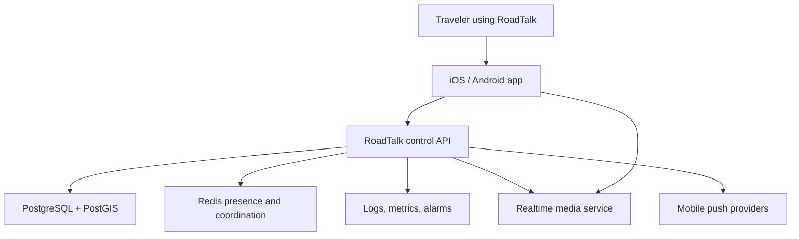

# RoadTalk System Architecture

- Status: Proposed baseline
- Sprint: 0 — Planning & Architecture
- Requirements: S00-R01, S00-R02, S00-R03, S00-R04, S00-R05, S00-R09, S00-R10, S00-R11
- Last updated: 2026-07-12

## Purpose

RoadTalk provides location-aware, push-to-talk voice communication for nearby travelers. The MVP covers Sprints 1–5: project foundation, identity, location, push-to-talk, and proximity filtering.

This architecture deliberately begins as a modular monolith for control-plane behavior while keeping realtime media in a specialized WebRTC service. The boundary avoids premature microservices while allowing the media plane to scale independently.

## Architectural principles

- Voice safety and reliability take priority over feature breadth.
- Location and audio data are minimized by default.
- The control plane never relays realtime audio.
- Clients receive only the location precision required by an approved feature.
- Durable state belongs in PostgreSQL; transient presence and coordination may use Redis.
- Major choices remain replaceable behind documented interfaces.
- AWS resources are defined through Terraform when infrastructure implementation begins.
- Sprints 1–5 drive the MVP design; later features receive extension points, not speculative implementation.

## System context

## Major components

### Mobile application

Responsibilities:

- permission onboarding and disclosure
- anonymous identity bootstrap and session storage
- foreground and approved background location collection
- push-to-talk interaction and audio-device control
- channel and proximity presentation
- network-loss, permission-denied, reconnect, transmit, receive, and error states
- local minimization of location-update and diagnostic frequency

The proposed baseline is React Native with Expo development builds. Expo documents background location and background audio capabilities but also documents platform constraints and battery impact. Native build-time permission configuration is required for standalone/development builds and must be treated as a store-review requirement, not a late implementation detail.

### Control API

Responsibilities:

- session and identity lifecycle
- profile and callsign rules
- location-update validation
- proximity eligibility decisions
- channel membership and authorization
- creation of short-lived media access tokens
- abuse-control hooks and audit events
- API and realtime-control event delivery

The proposed baseline is a Python FastAPI modular monolith. REST endpoints handle durable commands and queries. WebSockets carry transient control events where immediate bidirectional updates are required. Voice packets never pass through FastAPI.

### Realtime media service

Responsibilities:

- WebRTC session negotiation
- encrypted audio transport
- NAT traversal through STUN/TURN
- room and participant enforcement
- publish/subscribe audio forwarding
- connection-quality telemetry

The proposed baseline is LiveKit using its React Native/Expo SDK. The RoadTalk API remains the authority for who may join, publish, or subscribe and issues short-lived scoped tokens. Self-hosted LiveKit requires explicit UDP/TCP/TURN networking and, when clustered, Redis and layer-4 load balancing. Those requirements must be tested before production architecture is accepted.

No audio recording, transcription, egress, or durable media storage is enabled for the MVP.

### PostgreSQL and PostGIS

Responsibilities:

- users, devices, sessions, profiles, channels, memberships, and policy state
- current approved location representation and limited history when explicitly required
- audit and moderation references
- migration history

PostGIS `geography` values use meters for distance operations. Nearby queries use `ST_DWithin` with a spatial index rather than calculating buffers or distances for every row.

### Redis

Responsibilities:

- ephemeral presence with expiration
- connection ownership and short-lived coordination
- rate-limit counters
- optional cross-instance event fanout
- LiveKit clustering only when the media tier grows beyond one node

Redis is not the source of truth for identities, authorization policy, or durable location history.

### Push notifications

APNs and FCM provide wake-up and asynchronous notification paths. Push notifications do not carry voice media or precise coordinates. Emergency semantics are out of scope until Sprint 9 requirements are approved.

### Observability

The initial design requires:

- structured application logs with correlation identifiers
- metrics for API latency, errors, WebSocket connections, media joins, reconnects, packet loss, and proximity-query performance
- alarms for availability, error rates, resource saturation, and abnormal join/token failures
- privacy filtering that prevents precise location, raw tokens, and audio content from entering logs

## Control and media planes

| Plane | Traffic | Authority | Durable storage |
|---|---|---|---|
| Control | HTTPS REST and WebSocket events | RoadTalk API | PostgreSQL |
| Media | WebRTC audio, ICE, STUN/TURN | LiveKit constrained by API-issued grants | None for MVP |
| Presence | Heartbeats and transient connection state | RoadTalk API | Redis with TTL |
| Notification | APNs/FCM payloads | RoadTalk API | Delivery metadata only when required |

## Representative push-to-talk flow

1. The mobile app maintains an authenticated control connection and sends location updates under the approved precision/frequency policy.
2. The API validates freshness, accuracy, plausibility, and user consent.
3. The proximity service calculates eligible recipients using PostGIS and current presence.
4. When the user presses transmit, the app requests permission to publish to an ephemeral media room.
5. The API applies identity, channel, proximity, mute, rate, and abuse rules.
6. The API returns a short-lived LiveKit token scoped to the permitted room and actions.
7. The mobile app publishes audio directly to LiveKit over WebRTC.
8. Eligible listeners receive permission to subscribe; ineligible users receive neither a room grant nor precise participant locations.
9. Releasing the button stops publication. Idle rooms and grants expire.
10. Metrics record technical outcomes without recording audio or precise coordinates.

## Trust boundaries

- **Device boundary:** The device and local storage are untrusted from the server's perspective. Location, clock, identity claims, and client state require validation.
- **Public network boundary:** All control and media traffic requires encryption in transit.
- **API boundary:** Authentication does not imply authorization. Every channel, proximity, publish, and subscribe action is re-evaluated.
- **Media boundary:** LiveKit tokens are short-lived and least-privilege. Media service credentials never ship in the mobile app.
- **Data boundary:** Database and cache run without public access. Administrative paths require separate authorization and audit controls.
- **Operations boundary:** Terraform state, CI/CD credentials, production secrets, and operator access are separated and logged.

## AWS deployment evolution

### Bootstrap and MVP validation

- one AWS Region
- public HTTPS control endpoint
- containerized FastAPI service
- PostgreSQL with PostGIS
- Redis only when presence/fanout behavior requires it
- one LiveKit node plus TURN-capable networking for controlled testing
- S3 for non-sensitive build/operational artifacts where required
- CloudWatch logs, metrics, and alarms
- Secrets Manager or SSM Parameter Store for secrets according to sensitivity and rotation requirements

### Growth path

- multiple API tasks across Availability Zones
- managed PostgreSQL with Multi-AZ and tested restore
- managed Redis with replication
- multiple LiveKit nodes using Redis coordination and layer-4 media load balancing
- separate worker processes only after measured workload or isolation requirements justify them
- WAF, enhanced detection, and dedicated operational controls as exposure and abuse risk grow

The exact services, topology, and costs remain deliverables S00-D05 and S00-D06.

## Data minimization rules

- Do not store audio for the MVP.
- Do not expose exact coordinates to nearby users.
- Store only the location precision and duration needed for active proximity decisions.
- Expire transient presence automatically.
- Keep diagnostic logs free of exact location, media tokens, credentials, and audio.
- Separate public identity fields from private account/device records.
- Make background location and microphone use visible and revocable.
- Define deletion propagation before Sprint 1 implementation.

## Failure behavior

| Failure | Required behavior |
|---|---|
| Control API unavailable | Stop new authorization decisions; show disconnected state; do not assume prior eligibility indefinitely. |
| Media service unavailable | Fail closed for transmit; preserve app navigation; provide retry state. |
| Location stale or inaccurate | Exclude or degrade proximity eligibility according to documented policy. |
| Redis unavailable | Fall back safely or mark presence unknown; never grant based on stale transient state. |
| Database unavailable | Reject durable mutations and new grants that require authorization state. |
| Token expired | Reauthorize through the API; never embed long-lived media credentials. |
| Permission revoked | Stop the affected collection or publication immediately and update UI state. |
| Network transition | Re-establish control and media sessions; re-evaluate proximity and authorization. |

## Open decisions

The following must be resolved through ADRs and later Sprint 0 deliverables:

- managed versus self-hosted LiveKit for initial field testing
- initial AWS compute and database topology
- Redis introduction threshold
- exact location precision, update frequency, and retention
- authentication mechanism and anonymous-account recovery
- API schema/versioning details
- measurable voice latency and packet-loss targets
- initial supported OS versions and accessibility targets

## Validation mapping

- S00-T01: component, boundary, interface, and ADR review
- S00-T02: representative control-flow walkthrough
- S00-T03: data-model walkthrough when S00-D04 is complete
- S00-T04: AWS and cost review when S00-D05/D06 are complete
- S00-T07: threat-model review when S00-D09 is complete
- S00-T08: privacy inventory when S00-D10 is complete
- S00-T09: measurable target review when S00-D11 is complete

## Primary references

- [Expo Location](https://docs.expo.dev/versions/latest/sdk/location/)
- [Expo Audio](https://docs.expo.dev/versions/latest/sdk/audio/)
- [Expo Permissions](https://docs.expo.dev/guides/permissions/)
- [LiveKit Expo SDK](https://docs.livekit.io/transport/sdk-platforms/expo/)
- [LiveKit self-hosted deployment](https://docs.livekit.io/transport/self-hosting/deployment/)
- [LiveKit tokens and grants](https://docs.livekit.io/frontends/reference/tokens-grants/)
- [FastAPI WebSockets](https://fastapi.tiangolo.com/advanced/websockets/)
- [PostGIS ST_DWithin](https://postgis.net/docs/ST_DWithin.html)
- [AWS RDS PostgreSQL PostGIS](https://docs.aws.amazon.com/AmazonRDS/latest/UserGuide/Appendix.PostgreSQL.CommonDBATasks.PostGIS.html)
- [AWS ECS inbound networking](https://docs.aws.amazon.com/AmazonECS/latest/developerguide/networking-inbound.html)
