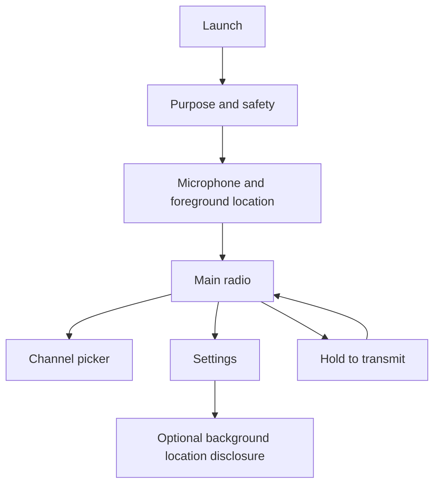

# RoadTalk MVP Wireframes

- Status: Approved interaction baseline
- Issue: #11
- Requirements: S00-R08
- Acceptance: S00-T06
- Date: 2026-07-12

[Open the phone-screen wireframe sheet](wireframes/mvp-phone-screens.svg).

## Navigation model

The main radio is the default authenticated destination. Core PTT operation requires no menu traversal.

## Required screens and states

### Purpose and safety

- concise Internet-CB purpose
- nearby communication is approximate, not a safety or emergency service
- continue without asking OS permissions
- privacy and terms links

### Permission onboarding

Separate steps and choices:

1. microphone explanation and request
2. foreground location explanation and request
3. notification offer
4. background location offered only later from a feature/settings flow

Denied state explains the unavailable capability, provides retry/settings guidance, and does not trap the user.

### Main radio — ready

- selected channel
- connection/location status
- coarse nearby count
- dominant PTT control
- accessible text label, not color alone
- channel and settings controls
- no map or exact nearby positions during MVP Sprints 1–5

### Transmitting

- dominant state label: TRANSMITTING
- elapsed time
- release instruction
- stop/cancel behavior
- visible microphone indicator
- channel retained but distracting navigation disabled

### Receiving

- dominant state label: RECEIVING
- speaker callsign when allowed
- mute action
- channel
- no exact distance/location
- PTT disabled or queued according to accepted single-speaker policy

### Connecting/reconnecting

- explicit connection status
- PTT disabled
- retry/backoff indication
- no false ready state
- allow exit/settings

### Location unavailable or stale

- explains that nearby eligibility cannot be determined
- foreground retry and OS settings
- pause/leave action
- no grant request

### Permission denied

- identify microphone versus location
- explain impact
- open OS settings
- continue in limited settings/help mode
- no repeated coercive prompt loop

### Error/degraded service

- stable problem category and recovery action
- request/correlation ID available under details
- no internal stack trace
- PTT fails closed
- cached eligibility is not presented as current

### Channel picker

- General and RV for the initial approved scope
- selected state
- unavailable/disabled state
- private channels absent until Sprint 6
- selection change is idempotent

### Settings/privacy

- active session/device
- foreground/background mode and OS permission status
- pause radio
- notifications
- privacy/terms versions
- delete account
- diagnostic information without sensitive content

## Interaction rules

- Hold-to-talk is the default safety model; release ends publication.
- A later toggle/hands-free mode requires a separate safety/privacy decision.
- Haptics and audio cues supplement visible/text state; they never replace it.
- No critical action depends on color alone.
- Core targets meet platform touch-size guidance.
- Driving-mode claims are prohibited until legal/product review.
- The app does not advertise emergency-service capability.

## State-transition acceptance matrix

| From | Trigger | To | Required result |
|---|---|---|---|
| Ready | Press/hold PTT | Authorizing | Control disabled until grant result. |
| Authorizing | Eligible grant | Transmitting | Visible/haptic/audio transmit state; scoped media publish. |
| Authorizing | Denied/error | Ready/degraded | No audio publication; clear reason/retry. |
| Transmitting | Release | Ready | Publication stops promptly; grant released/expires. |
| Ready | Eligible incoming audio | Receiving | Callsign/mute shown; no exact location. |
| Any radio state | Network loss | Reconnecting | PTT disabled; authorization re-evaluated after reconnect. |
| Any radio state | Location stale/revoked | Location unavailable | Media grant revoked/denied. |
| Any radio state | Microphone revoked | Permission denied | Publication stops and UI explains recovery. |

## Validation result

All required normal, loading, disconnected, permission-denied, transmitting, receiving, and error states are represented. The SVG uses phone-sized panels and the flow can be implemented without an unresolved navigation choice.
